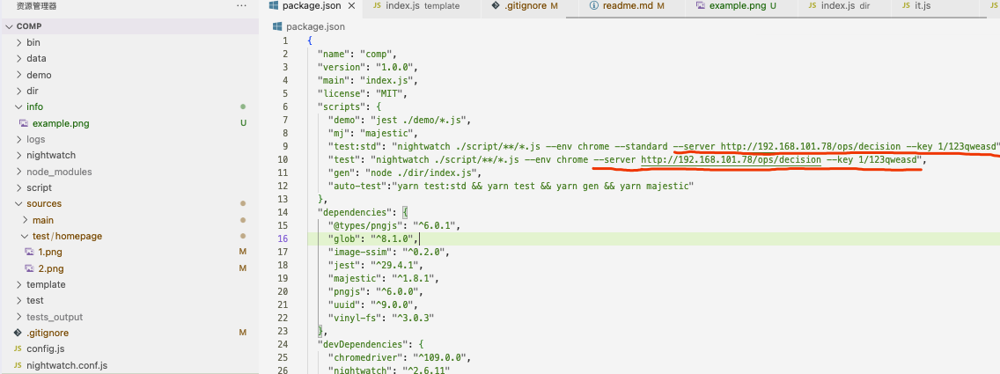
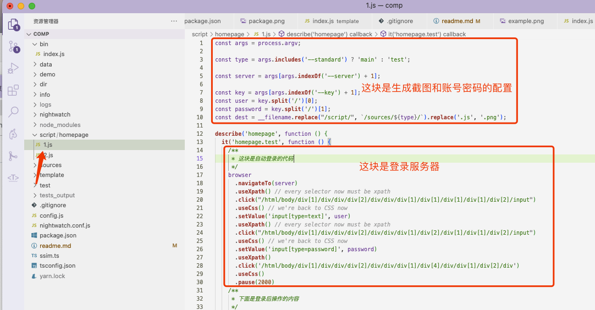
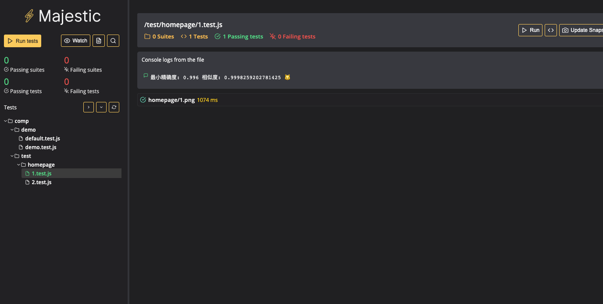

## 安装
`yarn`

# 使用说明
在package.json文件中，修改服务器地址和账号密码用于登录服务器
修改`test:std`和`test`两个命令的`--server`地址和`--key`账号密码

先生成标准截图，再生成测试截图

## 测试编写说明
只需要在`script`文件下编写操作和截图脚本，其它内容可完全自动化

参考写法

## 一键执行
`yarn auto-test`
会逐步执行下面命令
脚本执行完后会打开单测页面，在打开的浏览器上面手动操作测试用例即可

# 单步执行

## 生成截图
标准截图：`yarn test:std`
测试截图（冒烟）：`yarn test`

## 自动生成单测
单测脚本路径：`test/**/*.test.js` 路径对应图片资源路径

比如 `test/homepage/1.test.js` 

对应图片资源 `sources/main(test)/homepage/1.png`

自动生成单测命令 `yarn gen` 命令根据标准截图的路径，生成单测js，需要保证`标准截图`和`测试截图`同时存在对应截图文件

## 写操作
在`script`文件目录下写操作文件，`yarn gen`会根据`script`下的目录，在`sources`下构造同样目录的截图。
`demo`可以参考`script/homepage/1.js`

## 对比 (majestic)手动控制单测
`yarn mj`

## 图片资源
标准：`sources/main/**/*.png`
测试：`sources/test/**/*.png`

